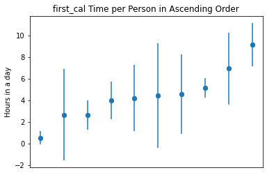
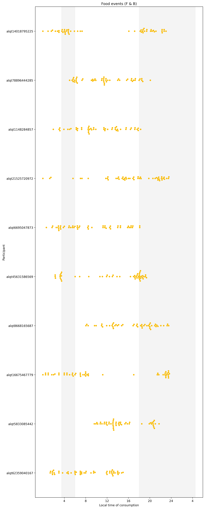

TREETS
================

<!-- WARNING: THIS FILE WAS AUTOGENERATED! DO NOT EDIT! -->

## Install

`pip install treets`

## Example for a quick data analysis on phased studies.

``` python
import treets.core as treets
import pandas as pd
```

Take a brief look on the food logging dataset and the reference
information sheet

``` python
treets.file_loader('data/col_test_data/yrt*').head(2)
```

<div>
<style scoped>
    .dataframe tbody tr th:only-of-type {
        vertical-align: middle;
    }

    .dataframe tbody tr th {
        vertical-align: top;
    }

    .dataframe thead th {
        text-align: right;
    }
</style>
<table border="1" class="dataframe">
  <thead>
    <tr style="text-align: right;">
      <th></th>
      <th>Unnamed: 0</th>
      <th>original_logtime</th>
      <th>desc_text</th>
      <th>food_type</th>
      <th>PID</th>
    </tr>
  </thead>
  <tbody>
    <tr>
      <th>0</th>
      <td>0</td>
      <td>2021-05-12 02:30:00 +0000</td>
      <td>Milk</td>
      <td>b</td>
      <td>yrt1999</td>
    </tr>
    <tr>
      <th>1</th>
      <td>1</td>
      <td>2021-05-12 02:45:00 +0000</td>
      <td>Some Medication</td>
      <td>m</td>
      <td>yrt1999</td>
    </tr>
  </tbody>
</table>
</div>

``` python
pd.read_excel('data/col_test_data/toy_data_17May2021.xlsx').head(2)
```

<div>
<style scoped>
    .dataframe tbody tr th:only-of-type {
        vertical-align: middle;
    }

    .dataframe tbody tr th {
        vertical-align: top;
    }

    .dataframe thead th {
        text-align: right;
    }
</style>
<table border="1" class="dataframe">
  <thead>
    <tr style="text-align: right;">
      <th></th>
      <th>mCC_ID</th>
      <th>Participant_Study_ID</th>
      <th>Study Phase</th>
      <th>Intervention group (TRE or HABIT)</th>
      <th>Start_Day</th>
      <th>End_day</th>
      <th>Eating_Window_Start</th>
      <th>Eating_Window_End</th>
    </tr>
  </thead>
  <tbody>
    <tr>
      <th>0</th>
      <td>yrt1999</td>
      <td>2</td>
      <td>S-REM</td>
      <td>TRE</td>
      <td>2021-05-12</td>
      <td>2021-05-14</td>
      <td>00:00:00</td>
      <td>23:59:00</td>
    </tr>
    <tr>
      <th>1</th>
      <td>yrt1999</td>
      <td>2</td>
      <td>T3-INT</td>
      <td>TRE</td>
      <td>2021-05-15</td>
      <td>2021-05-18</td>
      <td>08:00:00</td>
      <td>18:00:00</td>
    </tr>
  </tbody>
</table>
</div>

Call summarize_data_with_experiment_phases() function to make the table
that contains analytic information that we want.

``` python
df = treets.summarize_data_with_experiment_phases(treets.file_loader('data/col_test_data/yrt*')\
                      , pd.read_excel('data/col_test_data/toy_data_17May2021.xlsx'))
```

    Participant yrt1999 didn't log any food items in the following day(s):
    2021-05-18
    Participant yrt2000 didn't log any food items in the following day(s):
    2021-05-12
    2021-05-13
    2021-05-14
    2021-05-15
    2021-05-16
    2021-05-17
    2021-05-18
    Participant yrt1999 have bad logging day(s) in the following day(s):
    2021-05-12
    2021-05-15
    Participant yrt1999 have bad window day(s) in the following day(s):
    2021-05-15
    2021-05-17
    Participant yrt1999 have non adherent day(s) in the following day(s):
    2021-05-12
    2021-05-15
    2021-05-17

``` python
df
```

<div>
<style scoped>
    .dataframe tbody tr th:only-of-type {
        vertical-align: middle;
    }

    .dataframe tbody tr th {
        vertical-align: top;
    }

    .dataframe thead th {
        text-align: right;
    }
</style>
<table border="1" class="dataframe">
  <thead>
    <tr style="text-align: right;">
      <th></th>
      <th>mCC_ID</th>
      <th>Participant_Study_ID</th>
      <th>Study Phase</th>
      <th>Intervention group (TRE or HABIT)</th>
      <th>Start_Day</th>
      <th>End_day</th>
      <th>Eating_Window_Start</th>
      <th>Eating_Window_End</th>
      <th>phase_duration</th>
      <th>caloric_entries_num</th>
      <th>...</th>
      <th>logging_day_counts</th>
      <th>%_logging_day_counts</th>
      <th>good_logging_days</th>
      <th>%_good_logging_days</th>
      <th>good_window_days</th>
      <th>%_good_window_days</th>
      <th>outside_window_days</th>
      <th>%_outside_window_days</th>
      <th>adherent_days</th>
      <th>%_adherent_days</th>
    </tr>
  </thead>
  <tbody>
    <tr>
      <th>0</th>
      <td>yrt1999</td>
      <td>2</td>
      <td>S-REM</td>
      <td>TRE</td>
      <td>2021-05-12</td>
      <td>2021-05-14</td>
      <td>00:00:00</td>
      <td>23:59:00</td>
      <td>3 days</td>
      <td>7</td>
      <td>...</td>
      <td>3</td>
      <td>100.0%</td>
      <td>2.0</td>
      <td>66.67%</td>
      <td>3.0</td>
      <td>100.0%</td>
      <td>0.0</td>
      <td>0.0%</td>
      <td>2.0</td>
      <td>66.67%</td>
    </tr>
    <tr>
      <th>1</th>
      <td>yrt1999</td>
      <td>2</td>
      <td>T3-INT</td>
      <td>TRE</td>
      <td>2021-05-15</td>
      <td>2021-05-18</td>
      <td>08:00:00</td>
      <td>18:00:00</td>
      <td>4 days</td>
      <td>8</td>
      <td>...</td>
      <td>3</td>
      <td>75.0%</td>
      <td>2.0</td>
      <td>50.0%</td>
      <td>1.0</td>
      <td>25.0%</td>
      <td>2.0</td>
      <td>50.0%</td>
      <td>1.0</td>
      <td>25.0%</td>
    </tr>
    <tr>
      <th>2</th>
      <td>yrt2000</td>
      <td>3</td>
      <td>T3-INT</td>
      <td>TRE</td>
      <td>2021-05-12</td>
      <td>2021-05-14</td>
      <td>08:00:00</td>
      <td>16:00:00</td>
      <td>3 days</td>
      <td>0</td>
      <td>...</td>
      <td>0</td>
      <td>0.0%</td>
      <td>0.0</td>
      <td>0.0%</td>
      <td>0.0</td>
      <td>0.0%</td>
      <td>0.0</td>
      <td>0.0%</td>
      <td>0.0</td>
      <td>0.0%</td>
    </tr>
    <tr>
      <th>3</th>
      <td>yrt2000</td>
      <td>3</td>
      <td>T3-INT</td>
      <td>TRE</td>
      <td>2021-05-15</td>
      <td>2021-05-18</td>
      <td>08:00:00</td>
      <td>16:00:00</td>
      <td>4 days</td>
      <td>0</td>
      <td>...</td>
      <td>0</td>
      <td>0.0%</td>
      <td>0.0</td>
      <td>0.0%</td>
      <td>0.0</td>
      <td>0.0%</td>
      <td>0.0</td>
      <td>0.0%</td>
      <td>0.0</td>
      <td>0.0%</td>
    </tr>
    <tr>
      <th>4</th>
      <td>yrt2001</td>
      <td>4</td>
      <td>T12-A</td>
      <td>TRE</td>
      <td>NaT</td>
      <td>NaT</td>
      <td>NaN</td>
      <td>NaN</td>
      <td>NaT</td>
      <td>0</td>
      <td>...</td>
      <td>0</td>
      <td>nan%</td>
      <td>NaN</td>
      <td>NaN</td>
      <td>NaN</td>
      <td>NaN</td>
      <td>NaN</td>
      <td>NaN</td>
      <td>NaN</td>
      <td>NaN</td>
    </tr>
  </tbody>
</table>
<p>5 rows × 32 columns</p>
</div>

Look at resulting statistical information for the first row in the
resulting dataset.

``` python
df.iloc[0]
```

    mCC_ID                                           yrt1999
    Participant_Study_ID                                   2
    Study Phase                                        S-REM
    Intervention group (TRE or HABIT)                    TRE
    Start_Day                            2021-05-12 00:00:00
    End_day                              2021-05-14 00:00:00
    Eating_Window_Start                             00:00:00
    Eating_Window_End                               23:59:00
    phase_duration                           3 days 00:00:00
    caloric_entries_num                                    7
    medication_num                                         0
    water_num                                              0
    first_cal_avg                                   5.916667
    first_cal_std                                   2.240722
    last_cal_avg                                   19.666667
    last_cal_std                                   12.933323
    mean_daily_eating_window                           13.75
    std_daily_eating_window                        11.986972
    earliest_entry                                       4.5
    2.5%                                              4.5375
    97.5%                                            27.5625
    duration mid 95%                                  23.025
    logging_day_counts                                     3
    %_logging_day_counts                              100.0%
    good_logging_days                                    2.0
    %_good_logging_days                               66.67%
    good_window_days                                     3.0
    %_good_window_days                                100.0%
    outside_window_days                                  0.0
    %_outside_window_days                               0.0%
    adherent_days                                        2.0
    %_adherent_days                                   66.67%
    Name: 0, dtype: object

## Example for a quick data analysis on non-phased studies.

take a look at the original dataset

``` python
df = treets.file_loader('data/test_food_details.csv')
df.head(2)
```

<div>
<style scoped>
    .dataframe tbody tr th:only-of-type {
        vertical-align: middle;
    }

    .dataframe tbody tr th {
        vertical-align: top;
    }

    .dataframe thead th {
        text-align: right;
    }
</style>
<table border="1" class="dataframe">
  <thead>
    <tr style="text-align: right;">
      <th></th>
      <th>Unnamed: 0</th>
      <th>ID</th>
      <th>unique_code</th>
      <th>research_info_id</th>
      <th>desc_text</th>
      <th>food_type</th>
      <th>original_logtime</th>
      <th>foodimage_file_name</th>
    </tr>
  </thead>
  <tbody>
    <tr>
      <th>0</th>
      <td>1340147</td>
      <td>7572733</td>
      <td>alqt14018795225</td>
      <td>150</td>
      <td>Water</td>
      <td>w</td>
      <td>2017-12-08 17:30:00+00:00</td>
      <td>NaN</td>
    </tr>
    <tr>
      <th>1</th>
      <td>1340148</td>
      <td>411111</td>
      <td>alqt14018795225</td>
      <td>150</td>
      <td>Coffee White</td>
      <td>b</td>
      <td>2017-12-09 00:01:00+00:00</td>
      <td>NaN</td>
    </tr>
  </tbody>
</table>
</div>

preprocess the data to create features we might need in the furthur
analysis such as float time, week count since the first week, etc.

``` python
df = treets.load_food_data(df,'unique_code', 'original_logtime',4)
df.head(2)
```

<div>
<style scoped>
    .dataframe tbody tr th:only-of-type {
        vertical-align: middle;
    }

    .dataframe tbody tr th {
        vertical-align: top;
    }

    .dataframe thead th {
        text-align: right;
    }
</style>
<table border="1" class="dataframe">
  <thead>
    <tr style="text-align: right;">
      <th></th>
      <th>Unnamed: 0</th>
      <th>ID</th>
      <th>unique_code</th>
      <th>research_info_id</th>
      <th>desc_text</th>
      <th>food_type</th>
      <th>original_logtime</th>
      <th>date</th>
      <th>float_time</th>
      <th>time</th>
      <th>week_from_start</th>
      <th>year</th>
    </tr>
  </thead>
  <tbody>
    <tr>
      <th>0</th>
      <td>1340147</td>
      <td>7572733</td>
      <td>alqt14018795225</td>
      <td>150</td>
      <td>Water</td>
      <td>w</td>
      <td>2017-12-08 17:30:00+00:00</td>
      <td>2017-12-08</td>
      <td>17.500000</td>
      <td>17:30:00</td>
      <td>1</td>
      <td>2017</td>
    </tr>
    <tr>
      <th>1</th>
      <td>1340148</td>
      <td>411111</td>
      <td>alqt14018795225</td>
      <td>150</td>
      <td>Coffee White</td>
      <td>b</td>
      <td>2017-12-09 00:01:00+00:00</td>
      <td>2017-12-08</td>
      <td>24.016667</td>
      <td>00:01:00</td>
      <td>1</td>
      <td>2017</td>
    </tr>
  </tbody>
</table>
</div>

Call summarize_data() function to make the table that contains analytic
information that we want.¶

``` python
df = treets.summarize_data(df, 'unique_code', 'float_time', 'date')
df.head(2)
```

<div>
<style scoped>
    .dataframe tbody tr th:only-of-type {
        vertical-align: middle;
    }

    .dataframe tbody tr th {
        vertical-align: top;
    }

    .dataframe thead th {
        text-align: right;
    }
</style>
<table border="1" class="dataframe">
  <thead>
    <tr style="text-align: right;">
      <th></th>
      <th>unique_code</th>
      <th>num_days</th>
      <th>num_total_items</th>
      <th>num_f_n_b</th>
      <th>num_medications</th>
      <th>num_water</th>
      <th>first_cal_avg</th>
      <th>first_cal_std</th>
      <th>last_cal_avg</th>
      <th>last_cal_std</th>
      <th>eating_win_avg</th>
      <th>eating_win_std</th>
      <th>good_logging_count</th>
      <th>first_cal variation (90%-10%)</th>
      <th>last_cal variation (90%-10%)</th>
      <th>2.5%</th>
      <th>95%</th>
      <th>duration mid 95%</th>
    </tr>
  </thead>
  <tbody>
    <tr>
      <th>0</th>
      <td>alqt1148284857</td>
      <td>13</td>
      <td>149</td>
      <td>96</td>
      <td>19</td>
      <td>34</td>
      <td>7.821795</td>
      <td>6.710717</td>
      <td>23.485897</td>
      <td>4.869082</td>
      <td>15.664103</td>
      <td>8.231201</td>
      <td>146</td>
      <td>2.966667</td>
      <td>9.666667</td>
      <td>4.535000</td>
      <td>26.813333</td>
      <td>22.636667</td>
    </tr>
    <tr>
      <th>1</th>
      <td>alqt14018795225</td>
      <td>64</td>
      <td>488</td>
      <td>484</td>
      <td>3</td>
      <td>1</td>
      <td>7.525781</td>
      <td>5.434563</td>
      <td>25.858594</td>
      <td>3.374839</td>
      <td>18.332813</td>
      <td>6.603913</td>
      <td>484</td>
      <td>13.450000</td>
      <td>3.100000</td>
      <td>4.183333</td>
      <td>27.438333</td>
      <td>23.416667</td>
    </tr>
  </tbody>
</table>
</div>

Look at resulting statistical information for the first row in the
resulting dataset.

``` python
df.iloc[0]
```

    unique_code                      alqt1148284857
    num_days                                     13
    num_total_items                             149
    num_f_n_b                                    96
    num_medications                              19
    num_water                                    34
    first_cal_avg                          7.821795
    first_cal_std                          6.710717
    last_cal_avg                          23.485897
    last_cal_std                           4.869082
    eating_win_avg                        15.664103
    eating_win_std                         8.231201
    good_logging_count                          146
    first_cal variation (90%-10%)          2.966667
    last_cal variation (90%-10%)           9.666667
    2.5%                                      4.535
    95%                                   26.813333
    duration mid 95%                      22.636667
    Name: 0, dtype: object

## Clean text in food loggings

``` python
# import the dataset
df = treets.file_loader('data/col_test_data/yrt*')
df.head(3)
```

<div>
<style scoped>
    .dataframe tbody tr th:only-of-type {
        vertical-align: middle;
    }

    .dataframe tbody tr th {
        vertical-align: top;
    }

    .dataframe thead th {
        text-align: right;
    }
</style>
<table border="1" class="dataframe">
  <thead>
    <tr style="text-align: right;">
      <th></th>
      <th>Unnamed: 0</th>
      <th>original_logtime</th>
      <th>desc_text</th>
      <th>food_type</th>
      <th>PID</th>
    </tr>
  </thead>
  <tbody>
    <tr>
      <th>0</th>
      <td>0</td>
      <td>2021-05-12 02:30:00 +0000</td>
      <td>Milk</td>
      <td>b</td>
      <td>yrt1999</td>
    </tr>
    <tr>
      <th>1</th>
      <td>1</td>
      <td>2021-05-12 02:45:00 +0000</td>
      <td>Some Medication</td>
      <td>m</td>
      <td>yrt1999</td>
    </tr>
    <tr>
      <th>2</th>
      <td>2</td>
      <td>2021-05-12 04:45:00 +0000</td>
      <td>bacon egg</td>
      <td>f</td>
      <td>yrt1999</td>
    </tr>
  </tbody>
</table>
</div>

``` python
treets.clean_loggings(df, 'desc_text', 'PID').head(3)
```

<div>
<style scoped>
    .dataframe tbody tr th:only-of-type {
        vertical-align: middle;
    }

    .dataframe tbody tr th {
        vertical-align: top;
    }

    .dataframe thead th {
        text-align: right;
    }
</style>
<table border="1" class="dataframe">
  <thead>
    <tr style="text-align: right;">
      <th></th>
      <th>PID</th>
      <th>desc_text</th>
      <th>cleaned</th>
    </tr>
  </thead>
  <tbody>
    <tr>
      <th>0</th>
      <td>yrt1999</td>
      <td>Milk</td>
      <td>[milk]</td>
    </tr>
    <tr>
      <th>1</th>
      <td>yrt1999</td>
      <td>Some Medication</td>
      <td>[medication]</td>
    </tr>
    <tr>
      <th>2</th>
      <td>yrt1999</td>
      <td>bacon egg</td>
      <td>[bacon, egg]</td>
    </tr>
  </tbody>
</table>
</div>

We can see that words are lower cased, modifiers are removed(2nd row)
and items are split into individual items(third row).

## Visualizations

``` python
# import the dataset
df = treets.file_loader('data/test_food_details.csv')
df.head(2)
```

<div>
<style scoped>
    .dataframe tbody tr th:only-of-type {
        vertical-align: middle;
    }

    .dataframe tbody tr th {
        vertical-align: top;
    }

    .dataframe thead th {
        text-align: right;
    }
</style>
<table border="1" class="dataframe">
  <thead>
    <tr style="text-align: right;">
      <th></th>
      <th>Unnamed: 0</th>
      <th>ID</th>
      <th>unique_code</th>
      <th>research_info_id</th>
      <th>desc_text</th>
      <th>food_type</th>
      <th>original_logtime</th>
      <th>foodimage_file_name</th>
    </tr>
  </thead>
  <tbody>
    <tr>
      <th>0</th>
      <td>1340147</td>
      <td>7572733</td>
      <td>alqt14018795225</td>
      <td>150</td>
      <td>Water</td>
      <td>w</td>
      <td>2017-12-08 17:30:00+00:00</td>
      <td>NaN</td>
    </tr>
    <tr>
      <th>1</th>
      <td>1340148</td>
      <td>411111</td>
      <td>alqt14018795225</td>
      <td>150</td>
      <td>Coffee White</td>
      <td>b</td>
      <td>2017-12-09 00:01:00+00:00</td>
      <td>NaN</td>
    </tr>
  </tbody>
</table>
</div>

make a scatter plot for people’s breakfast time

``` python
# create required features for function first_cal_mean_with_error_bar()
df['original_logtime'] = pd.to_datetime(df['original_logtime'])
df['local_time'] = treets.find_float_time(df, 'original_logtime')
df['date'] = treets.find_date(df, 'original_logtime')

# call the function
treets.first_cal_mean_with_error_bar(df,'unique_code', 'date', 'local_time')
```



Use swarmplot to visualize each person’s eating time distribution.

``` python
treets.swarmplot(df, 50, 'unique_code', 'date', 'local_time')
```


